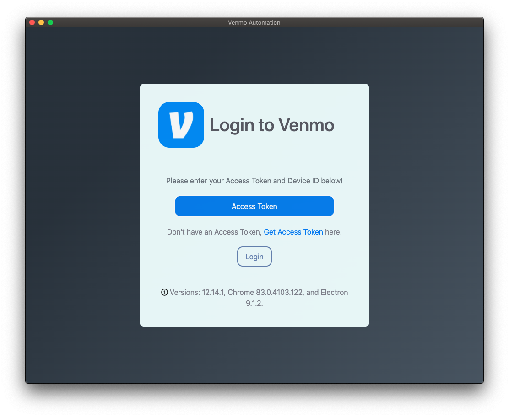
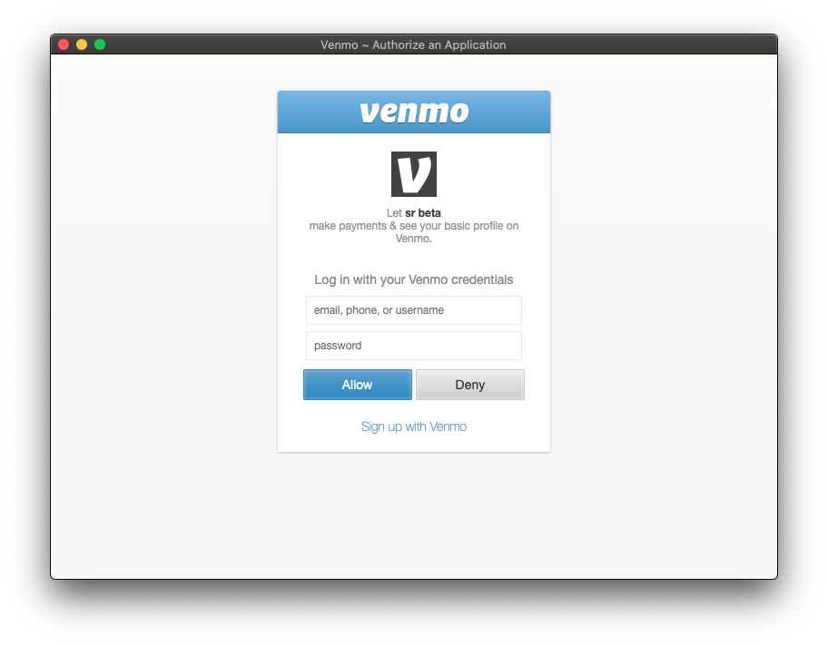
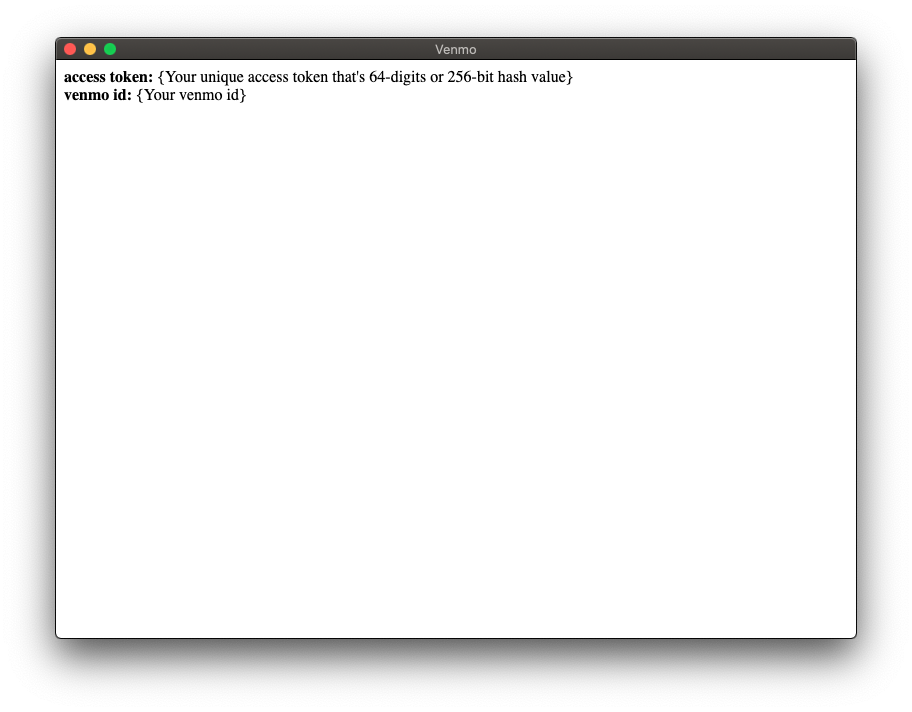
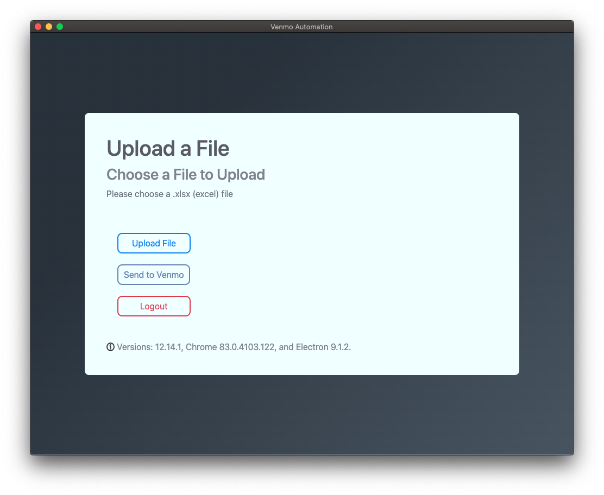
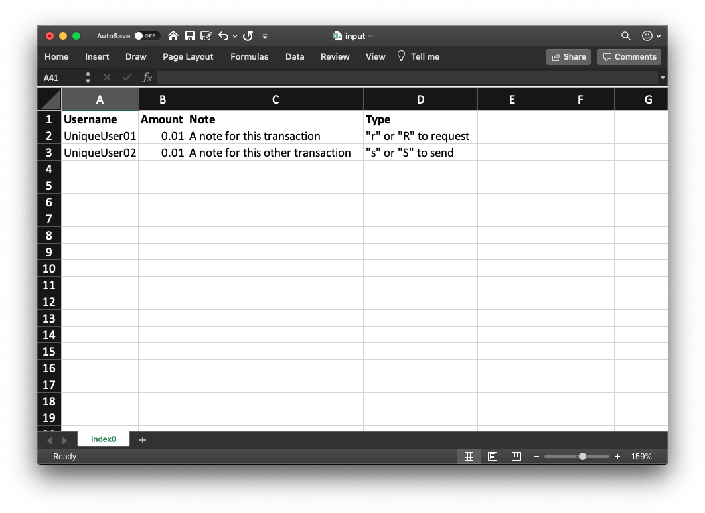

# Venmo Automation
This repository contains the code developed for Automating of Venmo Transactions. You will need Python versions 3.6+ because the Venmo Api is only compatible with those versions of python

# Desktop App

## 1) Installing the Necessary Utilities
### Python
You will need python for this project. Specifically python 3.6+ to use the venmo-api
### Installing Python
You can install Python [here](https://www.python.org/downloads/)
> NOTE you might have python 2 installed. Make sure you are using python 3.6 for this project

### Node, NPM, PIP
This project was created through electron.js. To see if you already have `node` ,`npm`, and `pip` installed , check using:

```bash
# check python version
python -V
# check node version
node -v
# check npm version
npm -v 
# check pip version
pip -V
```

If you don't have either of these, follow the installation below.

### Installing Node.js
Install Node.js [here](https://nodejs.org/en/download/).

### Installing NPM
You can install NPM from the command line with this command.
```bash
# install latest version of npm
[sudo] npm install npm@latest -g 
```
### Installing Pip
You can install pip with this [link](https://bootstrap.pypa.io/get-pip.py). You can also install it directly through the terminal using `curl`

```bash
# install latest version of pip
curl https://bootstrap.pypa.io/get-pip.py -o get-pip.py
# then run the following command in the folder where you have downloaded get-pip.py:
python get-pip.py
```

## 2) Installing the Necessary Libraries
### NPM Installs
To install all the necessary `node_modules` for your system. **Make sure you're in the project directory.**
```bash
# install node modules
npm install 
```

### Python/PIP installs
To install all the necessary python modules run the `pip installs`. You do not have to be in the project directory to install these
```bash
# install the modules individually run
pip install venmo-api
# and
pip install xlrd

# or to install them all at once run
python -m pip install -r requirements.txt
```

## 3) Running the Project
### NPM Start
Finally, run the desktop app locally. This is done with Electron.
```bash
npm start # runs the application
```

### Packaging the App
Running `npm start` allows for more customizablilty, but if all you want is to use the app you can package it using electron packager.
```bash
# packaging for windows
npm run package-win
# packaging for macOS
npm run package-mac
# sorry linux
```

This will create a folder called `release-builds/` where your app will be located.

You can create a windows installer by running:
```bash
# create an installer by running
node build.js
```
## 4) How to use the app

Paste your access token into the field



Click on __Get Access Token__


After a successful login


Get and access token through the link in the login page and copy and paste the access token into the app. 
You will have 3 buttons



### What the Buttons do
- Upload File - upload an xlsx or excel file with the following format



- Send to Venmo - After the file is uploaded, click "Send to Venmo" to submit the request
- Logout - The  **Access Token never expires**, if you want to **use the app without signing in again just close the app**, otherwise logout to delete and revoke the access token


# Running Through Terminal
Navigate to `terminal_app` and follow the instructions there
